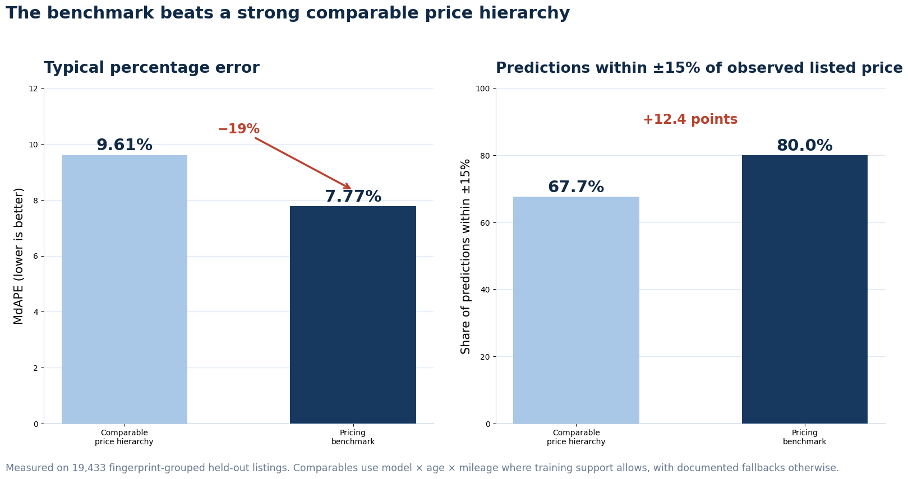
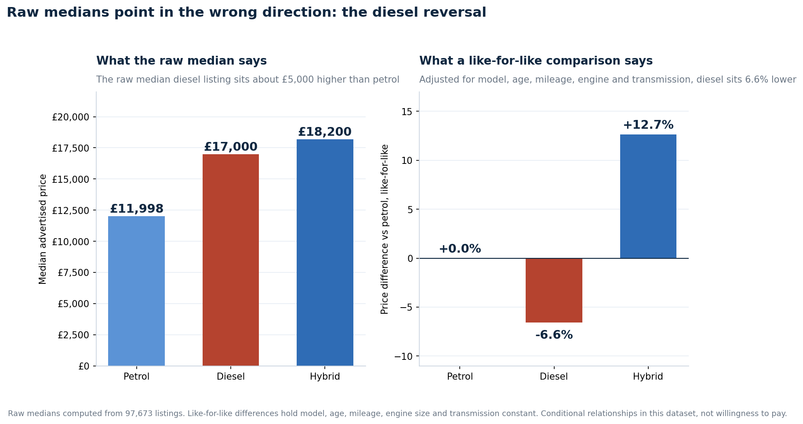
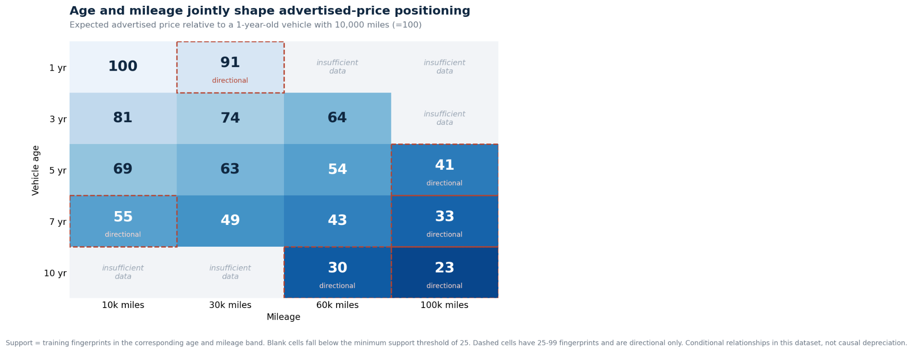
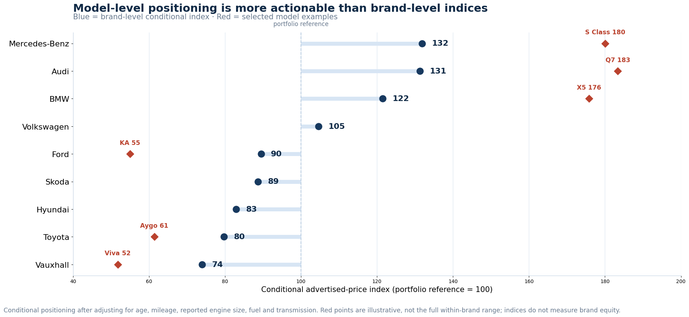
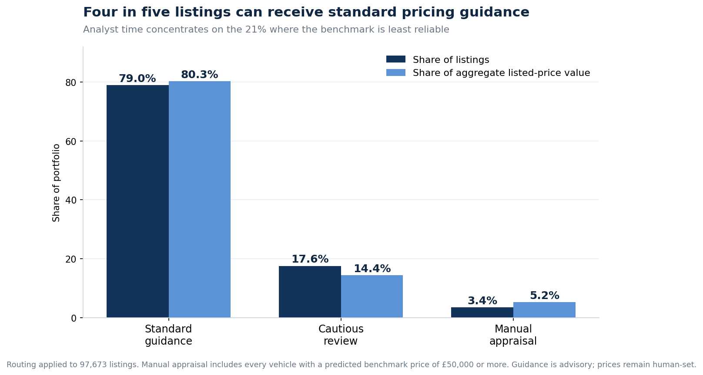

# Used Vehicle Pricing: A Benchmark the Team Can Actually Use

A commercial pricing case study using **97,673 historical UK used car listings collected through web scraping**. The project is framed around a pricing decision rather than modelling for its own sake.

> **In this repository:** this page contains the business recommendation. For the data audit, statistical design and validation, read [METHODOLOGY_AND_DATA_AUDIT.md](METHODOLOGY_AND_DATA_AUDIT.md).

**Prepared for:** Pricing Manager and partners in Commercial, Operations and Finance  
**Data scope:** 97,673 listings, 9 manufacturers and 195 models. Vehicle age uses 2020 as an assumed reference year; model years span from 1996 to 2020.

## The recommendation

Adopt a transparent benchmark for **expected advertised price** and run it in shadow mode before it influences any live price.

On 19,433 listings reserved for testing, the benchmark reduced typical percentage error from **9.61% to 7.77%** relative to a strong comparable price method. That method prioritized model, age and mileage matching whenever the training data contained at least 25 comparable specifications, then used a documented fallback hierarchy for thinner segments. Separately, **79% of the analytical portfolio qualifies for standard guidance reviewed by a person**.

Think of the benchmark as a copilot rather than an autopilot. It provides a consistent starting point based on the available evidence, while a pricing analyst still sets the final price.

It is intended to support three process improvements:

* **Consistency:** the same recorded attributes produce the same benchmark starting point.
* **Speed:** 79% of listings can receive immediate standard guidance.
* **Focus:** analyst attention is routed to the 21% requiring closer review.

Consistency and speed are expected process benefits. They were not measured in this dataset.

## First, the evidence that it improves price benchmarking

A benchmark should clear a credible alternative. The comparison method already used model, age and mileage where support allowed, with structured fallbacks otherwise. Both methods were evaluated on the same 19,433 test listings.

Here, **typical error** means median absolute percentage error (MdAPE): the median absolute percentage difference between predicted and observed listed price. **Average error** means mean absolute error (MAE), expressed in pounds.

| Test measure | Comparable price method | Pricing benchmark |
|---|---:|---:|
| MdAPE | 9.61% | **7.77%** |
| MAE | £2,355 | **£1,613** |
| Predictions within ±15% | 67.65% | **80.04%** |
| Predictions within ±20% | 78.60% | **90.35%** |

Adding mileage to the comparable hierarchy had already reduced MdAPE from 11.54% to 9.61%. The selected benchmark therefore improves on an already strengthened baseline rather than a weak straw man.

**What to do:** use the benchmark as the primary reference and keep the comparable estimate visible beside it. Material disagreement is a prompt to inspect the vehicle, not proof that either method is wrong.

## Three findings that should change how advertised prices are benchmarked

### 1. Raw portfolio medians can point in the wrong direction

The raw median diesel listing is approximately **£5,000 higher** than the raw median petrol listing. Taken alone, that could be mistaken for a diesel premium. After holding model, age, mileage, engine size and transmission constant, diesel is instead associated with a **6.59% lower advertised price** than petrol.

The sign reversal reflects portfolio composition. The mix of models, ages, mileage levels, engine sizes and transmissions within diesel listings creates the raw gap, rather than a standalone diesel premium.

Other conditional relationships in this dataset are:

* Hybrid versus petrol: **+12.66%**.
* Automatic versus manual: **+10.44%**.
* Semi automatic versus manual: **+11.82%**.

These are conditional advertised price associations already incorporated into the benchmark. They are not causal effects, estimates of willingness to pay or separate markups to add again.

**What to do:** do not derive pricing adjustments from raw portfolio averages or medians. Use like for like comparisons.

### 2. Age and mileage must be considered together

A fixed annual reduction followed by a fixed currency deduction per 10,000 miles misses the nonlinear and proportional relationships in this dataset. The benchmark estimates age and mileage simultaneously and combines their effects multiplicatively on the advertised price scale.

A vehicle that is five years old with 60,000 miles has an adjusted advertised price index of approximately **54**, relative to the supported reference of a vehicle that is one year old with 10,000 miles.

Blank cells have fewer than 25 training fingerprints and should not be used as standalone lookup guidance. Dashed cells have between 25 and 99 fingerprints and are directional only. These vehicles require additional analyst review.

**What to do:** use the combined age and mileage lookup or the benchmark itself. Do not apply independent flat percentage or currency deductions.

### 3. Model positioning is more actionable than brand averages

Differences between brands appear clearly in this dataset, but they are too broad for pricing individual vehicles. Mercedes-Benz has a conditional price index of approximately **132** against a portfolio reference of 100, while Vauxhall sits at **74**. Selected model indices range much more widely.

A blanket brand adjustment would obscure differences between models that are often larger than the gaps between brand averages.

**What to do:** anchor pricing at the manufacturer and model level. Use brand indices for portfolio positioning, not as adjustments for individual vehicles.

## How it works in practice: three tiers

Not every vehicle receives the same level of confidence. The benchmark routes each listing to an appropriate level of human involvement.

| Tier | Portfolio sizing | What it covers | What the team receives |
|---|---|---|---|
| **Standard guidance** | 79.00% of listings; 80.32% of listed price value | Up to 5 years old; under 60,000 miles; supported model and fuel category; complete required inputs; predicted benchmark below £50,000 | Expected advertised price, pooled 90% empirical uncertainty range and comparable cross check; analyst confirms the final price |
| **Cautious review** | 17.56% of listings; 14.43% of listed price value | Age from 6 to 10 years, mileage from 60,000 to 99,999, or thinner comparable support | Expected advertised price, wider pooled 95% uncertainty range and required analyst review |
| **Manual appraisal** | 3.43% of listings; 5.25% of listed price value | Age 11 or older, mileage of at least 100,000, missing or unclear required inputs, unsupported electric records, or a predicted benchmark of at least £50,000 | Specialist appraisal; the benchmark is context only and no calibrated range is issued |

Manual appraisal represents **3.43% of listings but 5.25% of aggregate listed price value**. All 1,020 vehicles with a predicted benchmark of £50,000 or more route to this tier because percentage error creates greater absolute exposure at higher prices.

The globally calibrated ranges are:

* **Tier 1 operating range:** pooled 90% empirical range, from 0.82× to 1.21× the point estimate. For a £15,000 estimate, this is approximately **£12,300 to £18,200**.
* **Tier 2 review range:** the wider pooled 95% empirical range, from 0.79× to 1.26×. For a £15,000 estimate, this is approximately **£11,800 to £18,900**.

These ranges describe historical benchmark error. They are not recommended pricing corridors, and global coverage does not guarantee the same coverage within every segment.

## What this analysis cannot tell you

These boundaries define how far the benchmark should be trusted:

* It uses **advertised prices**, not sale prices. It estimates what a vehicle would be listed at, not what it will sell for.
* It cannot establish overpricing or underpricing. A large gap may reflect condition, trim, options, history, geography or other information absent from the data. Treat every gap as a review prompt, never a verdict.
* It cannot identify a price that maximises profit because acquisition cost, preparation cost, margin and demand are unavailable.
* It cannot predict whether or how quickly a vehicle will sell.
* The £742 reduction in MAE is a reduction in benchmark error, not money saved.
* All reported relationships are associations in this dataset, not causal depreciation or customer willingness to pay.
* Results describe this historical UK listings dataset and its nine manufacturers. Exact listing dates are unavailable; vehicle age calculations assume 2020 as the reference year.

## What happens next

### Stage 1: Shadow mode

Produce guidance without changing live prices. Analysts price as normal and record whether they accepted or overrode the benchmark, by how much and why: trim, condition, options, history, local market, margin, stock strategy or data error.

The override log converts missing commercial information into structured data instead of treating every residual as mispricing.

### Stage 2: Live advisory

Move from shadow mode only when:

1. Every vehicle routes correctly and outputs are traceable.
2. Tier shares and input data quality are stable.
3. Override rates settle and map to known business reasons.
4. No segment shows persistent overrides in one direction without explanation or remediation.

These are process and trust criteria, not evidence that the benchmark improves commercial outcomes.

### Stage 3: Commercial validation

Begin collecting, in priority order:

1. Final sale price, sale status, listing date and sale date.
2. Trim, condition, service history and accident history.
3. Acquisition and preparation costs.
4. Enquiries and leads.

Only with those outcomes can the benchmark progress from a consistent advertised price reference to a tool tested against sales, demand and margin.

## Bottom line

Used car advertised price positioning is shaped jointly by manufacturer, model, age and mileage, with systematic conditional differences by fuel type, transmission and reported engine size. The transparent benchmark materially outperforms a strong comparable price hierarchy and can provide standard guidance, reviewed by a person, for 79% of the analytical portfolio.

It does not establish market value, optimal price, demand or expected time to sale. Unusual, older, high mileage and high value vehicles still require expert judgement.

## Repository contents

| File | Purpose |
|---|---|
| `README.md` | Business recommendation and executive findings |
| `METHODOLOGY_AND_DATA_AUDIT.md` | Data provenance, cleaning, statistical design and validation |
| `images/` | Final chart PNGs |

## Data source

[Kaggle: 100,000 UK Used Car Data Set](https://www.kaggle.com/datasets/adityadesai13/used-car-dataset-ford-and-mercedes). The source describes used car listings collected from the British market through web scraping.

This is an independent portfolio case study. It is not affiliated with or endorsed by Kaggle, a dealer, marketplace, lender or insurer, and it is not a recommendation for live pricing. The source data are not included in this repository; follow the dataset owner’s licensing and access terms.
